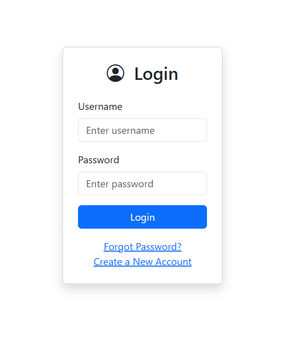
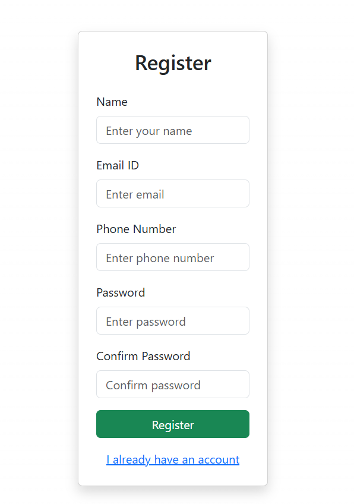
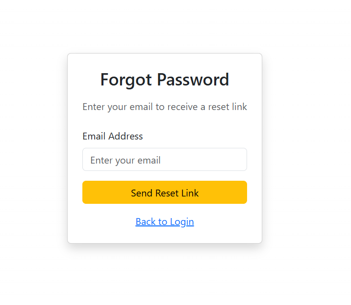
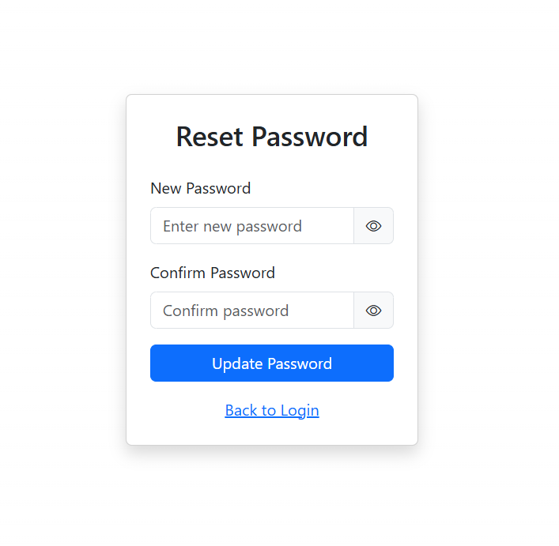
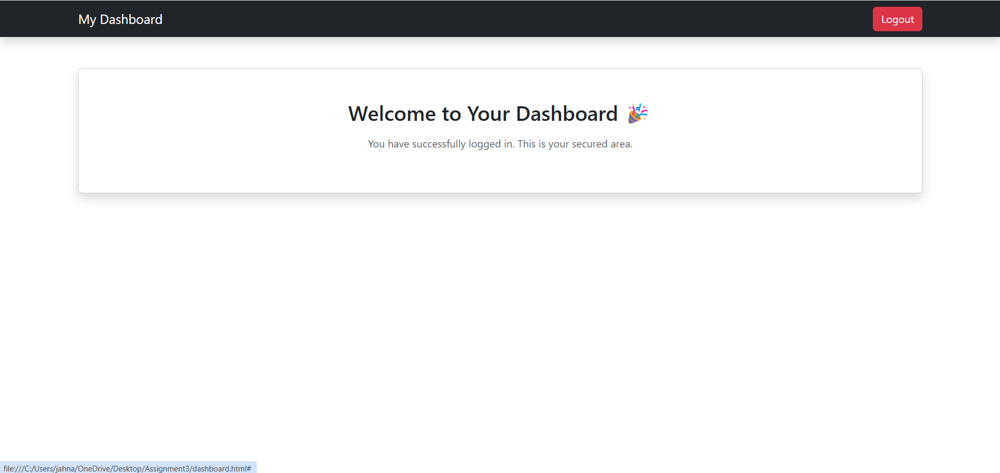

# Authentication System Styling (Assignment 2)

This project is an enhanced version of the basic authentication system, upgraded using **Bootstrap 5** and **custom CSS** to create a professional, responsive, and visually appealing user interface.

## Features

* Fully responsive design (Desktop, Laptop, Tablet, Mobile)
* Bootstrap 5 integration across all pages
* Clean and modern UI using Bootstrap components
* Custom CSS styling with gradient backgrounds and hover effects
* Google Fonts integration for better typography
* Password visibility toggle in Reset Password page
* Smooth transitions and card-based layout

---

## Pages Included

### 1. Login Page (index.html)

* Username and Password fields
* Styled login button
* Forgot Password link
* Create New Account link
* Centered card layout

### 2. Register Page (register.html)

* Name, Email, Phone Number inputs
* Password and Confirm Password fields
* Styled register button
* Navigation link to login
* Proper spacing and form styling

### 3. Forgot Password Page (forgot-password.html)

* Email input field
* Send reset link button
* Clean and minimal UI design

### 4. Reset Password Page (reset-password.html)

* New Password and Confirm Password fields
* Password visibility toggle 
* Styled update button

### 5. Dashboard Page (dashboard.html)

* Bootstrap navbar
* Welcome message
* Logout button
* Clean dashboard layout

---

## Technologies Used

* HTML5
* Bootstrap 5
* CSS3 (Custom Styling)
* Bootstrap Icons

---

## Project Structure

Assignment3/
│── index.html
│── register.html
│── forgot-password.html
│── reset-password.html
│── dashboard.html
│── styles.css
│── README.md
│
└── screenshots/
  ├── login.png
  ├── register.png
  ├── forgot-password.png
  ├── reset-password.png
  └── dashboard.png

---

## How to Run

1. Clone or download the repository
2. Open `index.html` in any browser
3. Navigate through pages using links and buttons

---

## Screenshots

### Login Page

### Register Page

### Forgot Password Page

### Reset Password Page

### Dashboard Page

---

## Assignment Highlights

* Bootstrap CDN added in all pages
* Proper use of cards, forms, buttons
* Responsive design implemented
* Custom CSS with colors, fonts, and effects
* Clean and well-structured code

---

## Author

**Gowda Jahnavi Nagesh**

---

## Notes

* This project does not include backend functionality (static navigation only)
* Designed as per assignment guidelines
* No pre-built templates were used
